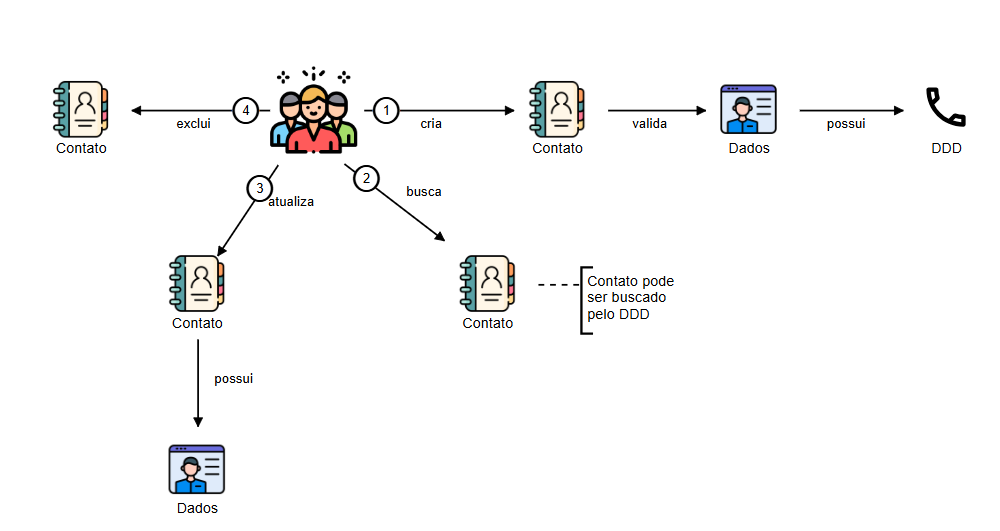
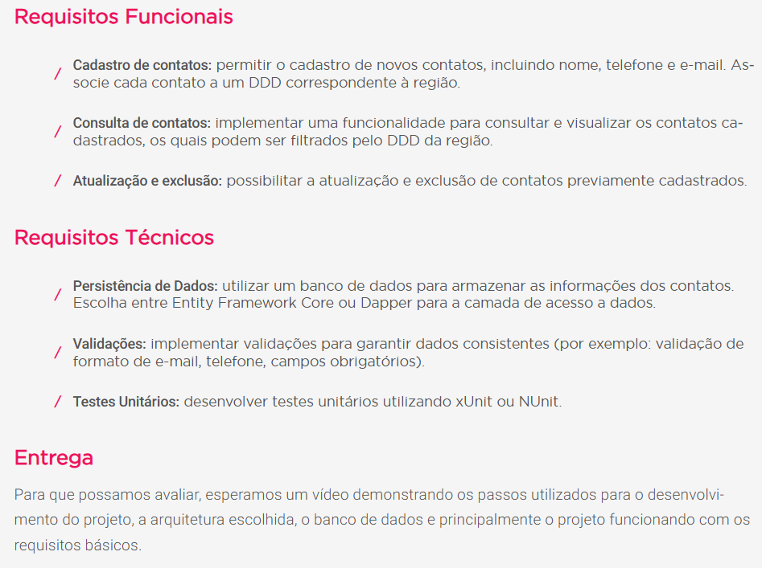

# Tech Challenger - Cadastro de Contatos Regionais

# Introdução

O Tech Challenge desta fase será desenvolver um aplicativo utilizando a plataforma .Net 8 para cadastro de contatos regionais, considerando a persistência de dados e a qualidade do software.

# Estudo de caso

Cenário de estudo de caso



# Domain StoryTelling

Para esclarecimento foi desenvolvido o domain storytelling. Esse vai ser o fluxo da solução LocalFriendzApi



# Endpoints

- POST /api/create-contact
  - Adiciona novos contatos, incluindo nome, telefone e e-mail.
  - Cada contato está associado a um DDD correspondente a região.
  - Validações para garantir dados consistentes.
- GET /api/list-all e /api/list-by-filter
  - Consulta contatos.
  - Possibilidade de filtrar pelo DDD.
  - Validações para garantir dados consistentes.
- PUT /api/update-contact
  - Atualização de contatos previamente cadastrado.
  - Validações para garantir dados consistentes.
- DELETE /api/delete-contact
  - Exclusão de contatos previamente cadastrado.
  - Validações para garantir dados consistentes.

# Tecnologias Utilizadas:

- **.NET 8**: Framework para construção da Minimal API.
- **C#**: Linguagem de programação usada no desenvolvimento do projeto.
- **Entity Framework**: ORM (Object-Relational Mapping) utilizado para interagir com o banco de dados.
- **xUnit**: Framework de testes utilizado para realizar testes unitários.
- **SQL Server**: Banco de dados relacional usado para armazenar os dados da aplicação.

# Banco de Dados

Para persistência dos dados foi criado duas tabelas, a saber:

```sql
/*
Autor:Jefferson Santos

Data de Criação: 19/06/2024

Propósito:
Este script é destinado a simplificar o acesso a informações sobre contatos.

*/

-- CRIACIATION
CREATE DATABASE DB_FIAP_ARQUITETO

-- USER DATABASE
USE DB_FIAP_ARQUITETO


CREATE TABLE TB_CONTACT(
	id_contact UNIQUEIDENTIFIER NOT NULL,
	[name] VARCHAR(100) NOT NULL,
	phone VARCHAR(20) NOT NULL,
	email VARCHAR(40),
	fk_id_area_code UNIQUEIDENTIFIER NOT NULL,
	FOREIGN KEY (fk_id_area_code) REFERENCES TB_AREA_CODE(id_area_code),
	PRIMARY KEY(id_contact)


-- Inserindo registros na tabela TB_CONTACT
INSERT INTO TB_CONTACT (id_contact, [name], phone, email, fk_id_area_code) VALUES
('660e8400-e29b-41d4-a716-446655440000', 'Alice Johnson', '555-1234', 'alice.johnson@example.com', '550e8400-e29b-41d4-a716-446655440000'),
('660e8400-e29b-41d4-a716-446655440001', 'Bob Smith', '555-5678', 'bob.smith@example.com', '550e8400-e29b-41d4-a716-446655440001'),
('660e8400-e29b-41d4-a716-446655440002', 'Carol White', '555-9012', 'carol.white@example.com', '550e8400-e29b-41d4-a716-446655440002');

-- Inserindo um novo registro de contato para Bob Smith com outro telefone
INSERT INTO TB_CONTACT (id_contact, [name], phone, email, fk_id_area_code) VALUES
('660e8400-e29b-41d4-a716-446655440003', 'Bob Smith', '555-6789', 'bob.smith@example.com', '550e8400-e29b-41d4-a716-446655440001');

-- SELECTS SOME RECORD
SELECT * FROM TB_CONTACT

```

Este comando cria uma nova migração baseada nas alterações feitas no modelo de dados.

```
Add-Migration NomeDaMigracao
```

Este comando aplica todas as migrações pendentes ao banco de dados.

```
Update-Database
```

# Documentação
- [Documentação da API](https://horse-neon-79c.notion.site/Documenta-o-da-API-04183b890d7c47cb89af4445d01d6678?pvs=4)
- [Documentação de Estilo para C#](https://horse-neon-79c.notion.site/Documenta-o-de-Estilo-para-C-de62b229fd01436a96f7a090b4d11e27?pvs=4)
- [Documentação dos Testes](https://horse-neon-79c.notion.site/Documenta-o-dos-Testes-a402a32a16a24b1b925dab83201e7d19?pvs=4)
- [Documentação de Banco de Dados](https://horse-neon-79c.notion.site/Documenta-o-de-Banco-de-Dados-6ba60c4c8533491a9d28da71f6b57c93?pvs=4)
- [Guia de Estrutura do Projeto](https://horse-neon-79c.notion.site/Guia-de-Estrutura-do-Projeto-fbfbc24c616d456bb56306cfda2c0bc9?pvs=4)

# **Checklist de Conclusão de Tarefas**

- [x]  Consultar contatos
- [x]  Consultar contatos pelo DDD
- [x]  Atualizar contato
- [x]  Excluir contato
- [x]  Persistência de dados com EF
- [x]  Validação de e-mail, telefone e campos obrigatórios
- [x]  Testes Unitários
- [x]  Vídeo exibindo a entrega
